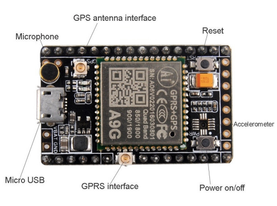

# Bus-Tracking-System
This project was implemented using Hardware and Software.

# System Architecture 

# Key features of the A9G module include:
 Powerful CPU: It operates at up to 160 MHz.
 Complete WiFi subsystem: Complies with IEEE 802.11b/g/n protocol and supports Station mode, SoftAP mode, SoftAP + Station mode, and promiscuous mode.
 Bluetooth LE subsystem: Supports features of Bluetooth 5 and Bluetooth mesh.
 Ultra-Low Power: Deep sleep power consumption is about 43μA.
 Better RF performance: External RF antenna included.
 Battery charging chip: Supports lithium battery charge and discharge management.
 Rich on-chip resources: 400KB of SRAM, and 4MB of on-board flash memory.
 Ultra small size: As small as a thumb (20x17.5mm).
 Reliable security features: Cryptographic hardware accelerators that support AES-128/256, Hash, RSA, HMAC, digital signature and secure boot.
 Rich interfaces: 1xI2C, 1xSPI, 2xUART, 11xGPIO (PWM), 4xADC, 1xJTAG bonding pad interface.
 Single-sided components, surface mounting design.

# Key features of the Seeed Studio XIAO ESP32C3 include:
 Powerful CPU: ESP32-C3, 32bit RISC-V singlecore processor that operates at up to 160 MHz.
 Complete WiFi subsystem: Complies with IEEE 802.11b/g/n protocol and supports Station mode, SoftAP mode, SoftAP + Station mode, and promiscuous mode.
 Bluetooth LE subsystem: Supports features of Bluetooth 5 and Bluetooth mesh.
 Ultra-Low Power: Deep sleep power consumption is about 43μA.
 Better RF performance: External RF antenna included.
 Battery charging chip: Supports lithium battery charge and discharge management.
 Rich on-chip resources: 400KB of SRAM, and 4MB of on-board flash memory.
 Ultra small size: As small as a thumb (20x17.5mm).
 Reliable security features: Cryptographic hardware accelerators that support AES-128/256, Hash, RSA, HMAC, digital signature and secure boot.
 Rich interfaces: 1xI2C, 1xSPI, 2xUART, 11xGPIO (PWM), 4xADC, 1xJTAG bonding pad interface.
 Single-sided components, surface mounting design.

